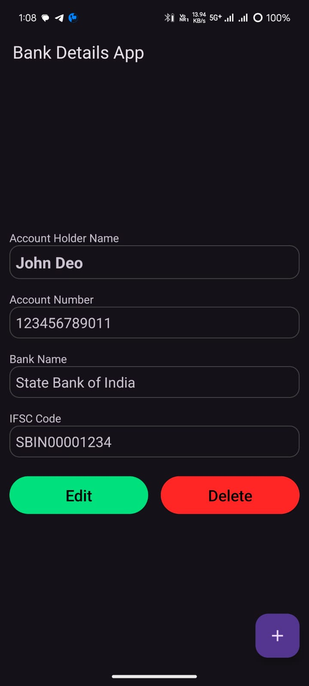
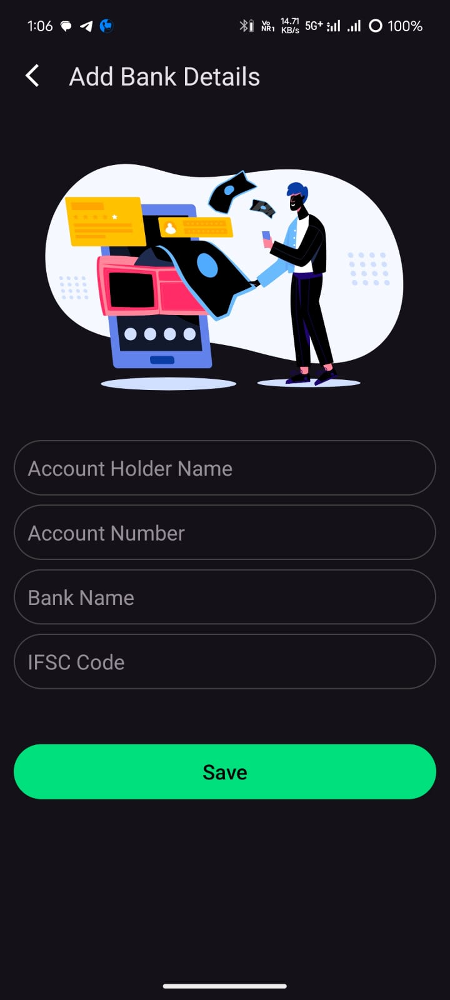
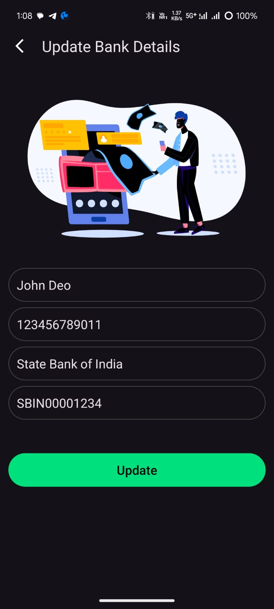

# 💳 Bank Details App (with Firebase Firestore & Anonymous Auth)

A simple Android application built using **Kotlin**, **MVVM architecture**, **Firebase Firestore**, and **Firebase Anonymous Authentication** that allows a user to add, update, view, and delete **one bank detail per user**.

## ✨ Features

- 🔐 **Anonymous Login**: Firebase anonymous authentication for unique identification per device.
- 📝 **Add/Update Bank Details**: Add bank account information with name, account number, IFSC code, etc.
- 👀 **View Details**: Shows saved bank details (only one per user).
- ❌ **Delete Details**: Delete your bank account information.
- ☁️ **Cloud Storage**: All data is stored securely in Firebase Firestore.
- 🧠 **MVVM Architecture**: Clean and modular codebase.

## 📷 Screenshots

| Empty State | Bank Details | Add State | Update Details |
|-------------|--------------------|-------------|--------------------|
|  |  |  |  |

## 📁 Folder Structure
```
com.example.bankdetailsapp/
├── model/
│ └── BankDetails.kt
├── repository/
│ └── BankRepository.kt
├── screens/
│ ├── MainActivity.kt
│ └── AddBankActivity.kt
├── utils/
│ └── FirebaseAuthUtil.kt
├── viewmodel/
│ └── BankViewModel.kt
└── res/
├── layout/
│ ├── activity_main.xml
│ └── activity_add_bank.xml
└── values/
```

## 🔧 Tech Stack

- Kotlin (Android)
- Firebase Firestore
- Firebase Authentication (Anonymous)
- MVVM (ViewModel + LiveData)
- ViewBinding

## 🚀 How it works

1. **Anonymous Auth**: On first app open, user is anonymously authenticated with Firebase.
2. **Add Bank**: A user can add only one bank detail, stored using their unique UID.
3. **Update/Delete**: The same bank details can be updated or deleted.
4. **Data Fetch**: On app open or resume, the latest bank data is fetched.

## 🧪 Firestore Structure
```
Collection: bank_details
└── Document ID: <user_uid>
├── name: "John Doe"
├── accountNumber: "1234567890"
├── bankName: "State Bank of India"
└── ifscCode: "SBIN0001234"
```
